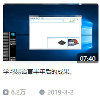

## 个人

* #### 你好鴨 😆， 這裡是霧削木的個人開發主頁 😋！

  
  

  >

    <h4><a href="https://space.bilibili.com/323611141"> >>>嗶哩嗶哩頻道：霧削木FHZ<<< </a></h4>

### 經歷路程

* #### 個人開發經歷

        

  

* >第一個軟件作品被製作出來視頻是2019年的3月2日
  >
  >
  >
  >隨後的視頻在我的B站頻道[主頁]（ https://space.bilibili.com/323611141 ）都可以看到。
  >（霧
  
* 我在製作無聊的項目和一些程式碎片 😙， 如果你能喜歡它那真的太好了 🤣。 （一直都是這樣 🤗。
  
'''python

'''
  

### 歡迎加入我的QQ交流群：806278403，一起交流~！

  

  

