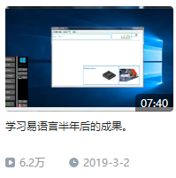

<!-- README.md · WuXiaoMuer (雾削木) -->

<div align="center">

<!-- 动态文字横幅 -->


<br/>

<!-- 头像（保持原始比例）+ 名字 -->
<a href="https://github.com/WuXiaoMuer">
  
</a>

<h1>雾削木 · WuXiaoMuer</h1>

<p>
  <em>一个热爱创造与折腾的独立开发者 · 自 2016 起</em>
</p>

<!-- 状态徽章 -->
<p>
  
  
  
  
</p>

<!-- 社交链接 -->
<p>
  <a href="https://space.bilibili.com/323611141"></a>
  &nbsp;
  <a href="https://afdian.com/a/WuXiaoMu"></a>
</p>

<!-- 访客计数（使用国内可访问的 komarev 服务） -->
<p>
  
  &nbsp;
  
</p>

</div>

<br/>

<!-- ============================== 关于我 ============================== -->

##  关于我

<table>
<tr>
<td width="60%" valign="top">

从 **2016 年**开始折腾各种技术，做过 Minecraft 插件、易语言小工具、Unity 游戏、嵌入式开发，也写过 Web 前后端。

一直在做项目和一些程式碎片 😙，如果你能喜欢它真的太好了 🤣

</td>
<td width="40%" align="center" valign="top">

**🎯 兴趣方向**
- 🎮 游戏开发 (Unity)
- 🔌 嵌入式 (ESP / Arduino / STM32)
- 🌐 Web 全栈
- 🤖 创意小工具

</td>
</tr>
</table>

> 第一个软件作品视频发布于 **2019 年 3 月 2 日**：`Hems X 虚拟桌面模拟程序`
>
> 
>
> 更多视频可以在我的 B 站频道主页查看 👉 [space.bilibili.com/323611141](https://space.bilibili.com/323611141)

<br/>

<!-- ============================== 技术栈 ============================== -->

## 🛠️ 技术栈

<details>
<summary><b>🧬 编程语言（点击展开）</b></summary>
<br/>

<p>
  
  
  
  
  
  
  
  
  
  
  
  
  
</p>

</details>

<details>
<summary><b>🎮 框架 / 平台</b></summary>
<br/>

<p>
  
  
  
  
  
  
  
</p>

</details>

<details>
<summary><b>🧰 常用工具</b></summary>
<br/>

<p>
  
  
  
  
  
  
  
  
</p>

</details>

<br/>

<!-- ============================== 成长路线 ============================== -->

## 📈 成长路线

```text
2016 ──▶ Minecraft / 易语言 / E4A
2017 ──▶ Unity3D + JavaScript
2018 ──▶ Unity3D + C# / C#
2019 ──▶ C/C++ / HTML + CSS + JavaScript / 首个作品发布
2020 ──▶ Node.js / Java / Python
2021 ──▶ ESP8266 / Arduino / MongoDB
2022 ──▶ Go + Rust / ESP32 + STM32 + Mixly
2023 ──▶ 数字电路、模拟电路 / C51
2024 ──▶ RT-Thread Vision Board
2025 ──▶ ... 继续探索中 🚀
```

<br/>

<!-- ============================== GitHub 数据 ============================== -->

## 📊 GitHub 数据

<div align="center">

<!-- 卡片 1：综合统计 -->


<!-- 卡片 2：常用语言 -->


<br/>

<!-- 卡片 3：连续贡献（streak） -->


</div>

<br/>

<!-- 活动图（contribution graph） -->
<div align="center">
  
</div>
<br/>

<!-- ============================== 精选项目 ============================== -->

## 🚀 精选项目

<div align="center">

<a href="https://github.com/WuXiaoMuer/WuXiaoMuer">
  
</a>

</div>

> 💡 仓库内收藏了我个人做过的部分项目片段，持续更新中……

<br/>

<!-- ============================== 交流与支持 ============================== -->

## 💬 交流与支持

<div align="center">

| 联系方式 | 链接 |
|:---:|:---|
| 📢 **QQ 交流群** | `994035508` |
| 🎬 **Bilibili** | [@雾削木 WuXiaoMu](https://space.bilibili.com/323611141) |
| ☕ **爱发电** | [afdian.com/a/WuXiaoMu](https://afdian.com/a/WuXiaoMu) |
| 📧 **Email** | *可通过 B 站私信联系* |

</div>

> ❤️ 如果你喜欢我的项目，欢迎通过 **爱发电** 赞助支持我的创作！

<br/>

---

<!-- ============================== 页脚 ============================== -->

<div align="center">


&nbsp;&nbsp;

&nbsp;&nbsp;

&nbsp;&nbsp;

&nbsp;&nbsp;

&nbsp;&nbsp;


<br/><br/>

<!-- 一行小图标 -->


<br/>

<sub>✨ Made with ❤️ by <a href="https://github.com/WuXiaoMuer">WuXiaoMuer</a> · 雾削木 · 自 2019</sub>

</div>